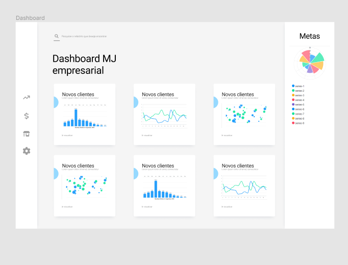

# Dashboard

Painel de controle com diversos gráficos informativos.
Esse painel utiliza o padrão de projeto MVC, ou seja, a API utilizada para receber dados do banco MySQL se localiza em "/controllers"

## Configurações
Dentro de "/src/config" encontra-se um arquivo responsável pelas definições do banco de dados, bem como nome do mesmo e nome das tabelas. O mesmo arquivo é responsável por chamar o gerenciador de arquivos Composer

